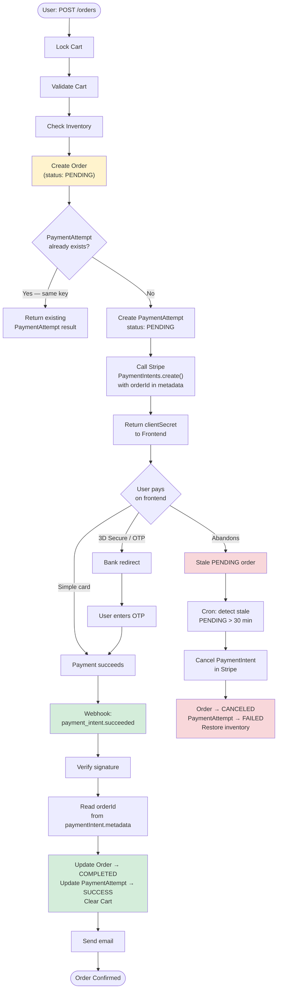
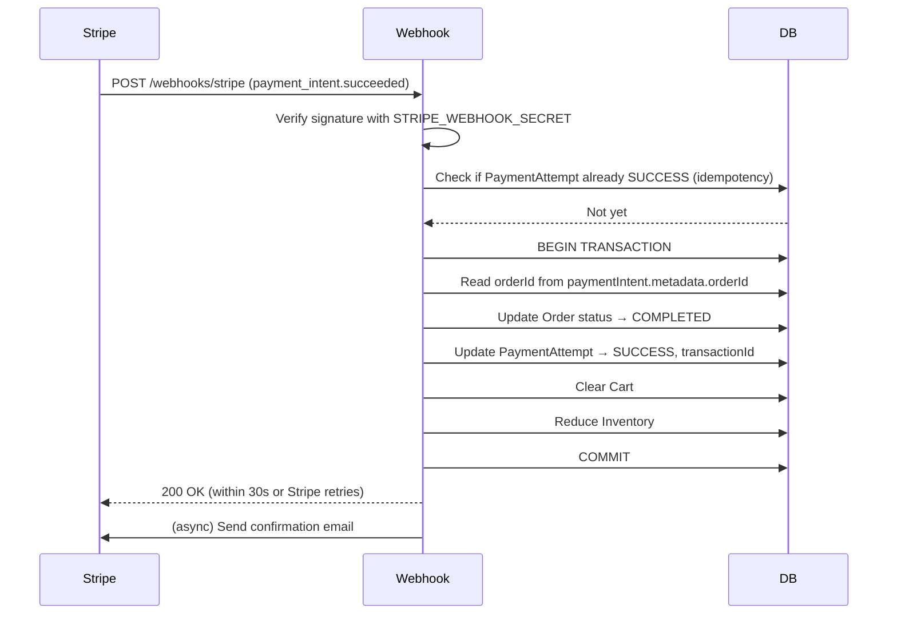

# Payment Gateway Integration - Technical Design Document

**Date:** 2026-03-30  
**Purpose:** Multi-Gateway Payment Integration with Idempotency and Reliability Guarantees  
**Scope:** Stripe, PayPal, Amadeus, Paymob, Cash on Delivery

---

## 1. Overview

This document describes the actual payment architecture implemented in this system. The core design follows the **"Order First, Pay Last"** pattern with idempotency protection and webhook-based final confirmation.

### Key Features
- ✅ **Order First** — Order saved as `PENDING` before any money moves
- ✅ **`orderId` embedded in Stripe metadata** — webhook always knows which order to confirm
- ✅ **Idempotency keys** — prevents double-charges on retries and network failures
- ✅ **DB-level idempotency guard** — `PaymentAttempt` deduplicated by `idempotencyKey`
- ✅ **Webhook-based final confirmation** — authoritative server-to-server confirmation
- ✅ **3D Secure / SCA compliant** — via Payment Intents API
- ✅ **Strategy pattern** — provider-agnostic (Stripe, PayPal, COD, etc.)

---

## 2. Why "Order First, Pay Last"?

The alternative ("Pay First, Order on Webhook") creates an unsolvable problem:

> **Problem:** If payment succeeds but the connection drops before your server records the `orderId`, you have taken money but don't know which order it's for.

By creating the order **before** calling Stripe and embedding its `orderId` in the Payment Intent metadata:

- Stripe permanently stores the `orderId` — survives any connection drop
- Webhook receives the event with `orderId` in `paymentIntent.metadata.orderId`
- Even without your DB, manual reconciliation via the Stripe dashboard shows the order

---

## 3. Complete Payment Flow



---

## 4. Idempotency — Preventing Double Charges

### The Problem

A customer clicks "Place Order" twice quickly, or the network retries the request. Without idempotency, Stripe could be called twice and the customer charged twice.

### Two-Layer Idempotency Defense

#### Layer 1: DB-level guard in `OrderService.placeOrder()` (currently implemented)

`placeOrder()` runs this **before** the handler chain starts:

```typescript
// order.service.ts
const idempotencyKey = `cart_${customerId}_${restaurantId}`;

const { shouldProceed, existingOrder } = await this.handleIdempotencyCheck(idempotencyKey, requestTimestamp);
if (!shouldProceed) return existingOrder; // Return existing — no Stripe call

await this.createPendingAttempt(idempotencyKey, requestTimestamp); // P2002 catches race condition
```

`handleIdempotencyCheck` logic:

| Attempt status | Age | Action |
|---|---|---|
| None | — | `shouldProceed: true` — fresh request |
| `SUCCESS` | < 60 seconds | Return existing order — same request retried |
| `SUCCESS` | ≥ 60 seconds | `shouldProceed: true` — customer re-ordering |
| `PENDING` | < 5 minutes | Throw `409 Conflict` — currently in-flight |
| `PENDING` | ≥ 5 minutes | Mark `FAILED`, `shouldProceed: true` — stale, allow retry |
| `FAILED` | any | `shouldProceed: true` — retry after failure |

**Note on the idempotency key:** Currently `cart_${customerId}_${restaurantId}`. The Stripe-level key (Phase 2 migration target) should be `order_${orderId}` once `ProcessPaymentHandler` is migrated to `createPaymentIntent()`, since the `orderId` exists in context by then.

#### Layer 2: Stripe-level idempotency key (target after migration)

When `ProcessPaymentHandler` calls `createPaymentIntent()`, pass the key:

```typescript
await stripe.paymentIntents.create(
    { amount, currency, metadata: { orderId } },
    { idempotencyKey: `order_${orderId}` }  // ← Stripe deduplicates for 24 hours
);
```

If your server crashes and retries the Stripe call with the same key, Stripe returns the **same** PaymentIntent — no double charge.

#### Race Condition Guard (currently implemented)

If two requests pass `handleIdempotencyCheck` simultaneously before either inserts, the DB `UNIQUE` constraint on `idempotencyKey` causes the second `INSERT` to throw `P2002`, which is caught and converted to a `409 Conflict`:

```typescript
private async createPendingAttempt(key: string, timestamp: Date): Promise<void> {
    try {
        await paymentAttemptService.createPendingAttempt(key, null, 'UNKNOWN', timestamp);
    } catch (err: any) {
        if (err?.code === 'P2002') throw ConflictError("Order placement in progress");
        throw err;
    }
}
```

---

## 5. Actual Handler Chain

```
[OrderService.placeOrder()]
  ↓ handleIdempotencyCheck()     ← DB guard, runs BEFORE chain
  ↓ createPendingAttempt()       ← PaymentAttempt: PENDING
  ↓ prisma.$transaction()
      LockCartHandler
        → ValidateCartHandler
          → CheckInventoryHandler
            → CreateOrderHandler       ← Order created: PENDING
              → ProcessPaymentHandler  ← Calls PaymentService (Stripe)
                → ParallelOrderHandler (fire & forget):
                    - UpdateOrderStatusHandler
                    - ReduceInventoryHandler
                    - ClearCartHandler
                    - UnlockCartHandler
                    - NotifyRestaurantHandler
                    - NotifyCustomerHandler
                    - AuditLogHandler
  ↓ updateOrderId()              ← Links PaymentAttempt → orderId
  ↓ finalizeSuccessfulAttempt()  ← PaymentAttempt: SUCCESS
```

> [!IMPORTANT]
> The entire handler chain currently runs **inside** `prisma.$transaction()` with a 20-second timeout. This includes `ProcessPaymentHandler`. Once migrated to Payment Intents (async webhook flow), `ProcessPaymentHandler` should be moved **outside** the transaction — Stripe API calls inside a DB transaction risk timeout and cannot be rolled back.

### What happens if `ProcessPaymentHandler` throws?

The order is already `PENDING` in the DB. The `catch` block in `placeOrder()` marks the `PaymentAttempt` as `FAILED`. Two recovery paths:

1. **Stripe was never called** — `PaymentAttempt` → `FAILED`, order stays `PENDING`. Stale order cron cleans it up.
2. **Stripe was called but response never received** — Same `idempotencyKey` on Stripe means retrying returns the same PaymentIntent. Webhook will eventually confirm the order.

---

## 6. Webhook Handler — The Authoritative Confirmation



### Webhook Idempotency — Handling Retries

Stripe retries webhooks for up to **72 hours** if your server returns non-2xx. Your handler **must** be idempotent:

```typescript
private async handlePaymentSuccess(paymentIntent: any) {
    const orderId = paymentIntent.metadata.orderId; // ← from Stripe metadata
    const idempotencyKey = `order_${orderId}`;

    // Guard: already processed?
    const attempt = await paymentAttemptRepository.findByIdempotencyKey(idempotencyKey);
    if (attempt?.status === PaymentAttemptStatus.SUCCESS) {
        return; // Already done — return 200 so Stripe stops retrying
    }

    await prisma.$transaction(async (tx) => {
        // Update order
        // COMPLETED is the correct enum value (not CONFIRMED)
        await orderRepository.updateOrderStatus({ orderId, newOrderStatus: OrderStatusKey.COMPLETED }, tx);

        // Finalize payment attempt
        await paymentAttemptRepository.updateStatus(
            idempotencyKey,
            PaymentAttemptStatus.SUCCESS,
            paymentIntent.id,        // transactionId
            { amount: paymentIntent.amount / 100 }
        );

        // Clear cart, reduce inventory
        await cartService.clearCart(customerId, tx);
    });
}
```

---

## 7. Stale PENDING Order Recovery (Cron Job)

If the customer abandons after the order is created but before paying:

```typescript
// Runs every 5 minutes
cron.schedule('*/5 * * * *', async () => {
    const cutoff = new Date(Date.now() - 30 * 60 * 1000); // 30 minutes ago

    const staleOrders = await orderRepository.findStaleOrders({
        status: OrderStatusKey.PENDING,
        createdBefore: cutoff
    });

    for (const order of staleOrders) {
        // Cancel in Stripe if a PaymentIntent exists
        const attempt = await paymentAttemptRepository.findByOrderId(order.orderId);
        if (attempt?.transactionId) {
            await stripe.paymentIntents.cancel(attempt.transactionId).catch(() => {});
        }

        // Mark cancelled in DB
        // CANCELED is the correct enum value (not CANCELLED)
        await orderRepository.updateOrderStatus({
            orderId: order.orderId,
            newOrderStatus: OrderStatusKey.CANCELED
        });

        // restoreStock() is the correct method on menuItemService
        await menuItemService.restoreStock(order.orderId);
    }
});
```

---

## 8. Stripe PaymentIntent — What Must Be in Metadata

When creating the PaymentIntent, always include:

```typescript
await stripe.paymentIntents.create({
    amount: Math.round(order.totalAmount * 100),
    currency: 'usd',
    customer: stripeCustomerId,
    metadata: {
        orderId: order.orderId,           // ← CRITICAL: webhook uses this
        customerId: context.customerId,   // for debugging/reconciliation
        restaurantId: context.restaurantId
    },
    automatic_payment_methods: { enabled: true }
}, {
    idempotencyKey: `order_${order.orderId}`  // ← CRITICAL: prevents double charge
});
```

> [!CAUTION]
> If you forget `metadata.orderId`, the webhook cannot identify which order was paid. You'll have taken money with no way to fulfill the order automatically.

---

## 9. Database Schema

```prisma
model PaymentAttempt {
  idempotencyKey String              @id @map("idempotency_key")
  orderId        String?             @map("order_id")
  status         PaymentAttemptStatus
  provider       String
  transactionId  String?             @map("transaction_id")  // Stripe PaymentIntent ID
  responseData   Json?               @map("response_data")

  createdAt DateTime @default(now()) @map("created_at")
  updatedAt DateTime @updatedAt      @map("updated_at")

  order Order? @relation(fields: [orderId], references: [orderId])

  @@index([orderId])
  @@index([transactionId])
  @@map("payment_attempts")
}

enum PaymentAttemptStatus {
  PENDING   // Created, Stripe called, waiting for webhook
  SUCCESS   // Webhook confirmed payment_intent.succeeded
  FAILED    // Webhook confirmed payment_intent.payment_failed, or cron cancelled
}
```

---

## 10. Failure Scenarios & Recovery

| Scenario | What Happens | Recovery |
|----------|-------------|----------|
| **Client disconnects after order created, before Stripe called** | Order is `PENDING`, no PaymentAttempt | Cron cancels after 30 min |
| **Stripe call succeeds, server crashes before response stored** | Order is `PENDING`, Stripe has PaymentIntent with `orderId` | Webhook fires → finds `orderId` in metadata → confirms order |
| **Webhook fails (server down)** | Stripe retries for 72 hours | Server comes back up → webhook processed |
| **Webhook fires twice** (Stripe retry) | Second call: attempt already `SUCCESS` → early return 200 | No duplicate order update |
| **Customer pays again after PENDING** | Same `idempotencyKey` → Layer 1 returns existing attempt | No double charge |
| **DB transaction rolls back in webhook** | Returns 5xx → Stripe retries | Retried webhook succeeds on next attempt |

---

## 11. Environment Variables

```bash
STRIPE_SECRET_KEY=sk_test_...
STRIPE_PUBLISHABLE_KEY=pk_test_...
STRIPE_WEBHOOK_SECRET=whsec_...   # NEVER skip this — prevents fake webhooks
FRONTEND_URL=http://localhost:3000
```

---

## 12. Testing Checklist

### Start Testing

```bash
# Terminal 1
npm run dev

# Terminal 2 — forward webhooks
stripe listen --forward-to localhost:3000/webhooks/stripe
# Copy the whsec_... shown into .env as STRIPE_WEBHOOK_SECRET
```

### Test Scenarios

| Scenario | Card | Expected |
|----------|------|----------|
| Normal payment | `4242 4242 4242 4242` | Order → CONFIRMED |
| 3D Secure | `4000 0025 0000 3155` | OTP prompt → Order → CONFIRMED |
| Declined | `4000 0000 0000 0002` | PaymentAttempt → FAILED |
| Double request | Same request twice fast | Second request returns existing attempt |
| Abandon order | Do nothing | Cron cancels after 30 min |
| Webhook retry | `stripe trigger payment_intent.succeeded` twice | Second is no-op (idempotent) |

---

## 13. Future Enhancements

- [ ] Saved payment methods (store Stripe customer ID in `ProviderCustomer`)
- [ ] Partial refunds
- [ ] PayPal / Amadeus / Paymob strategies
- [ ] React/Vue frontend (replace EJS)
- [ ] Payment analytics dashboard
- [ ] Multi-currency support
